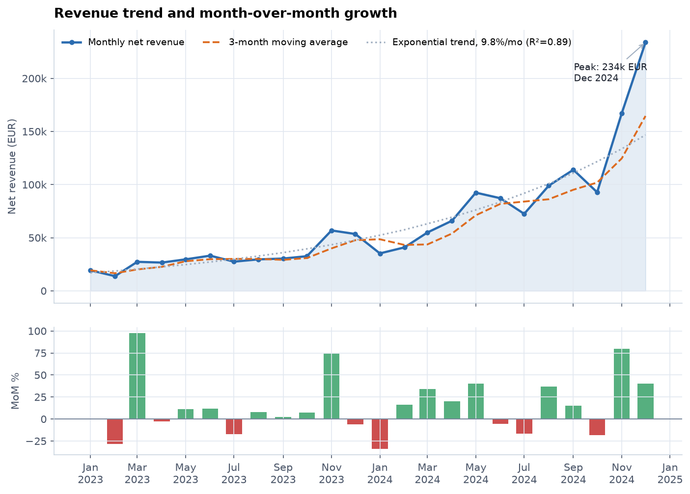
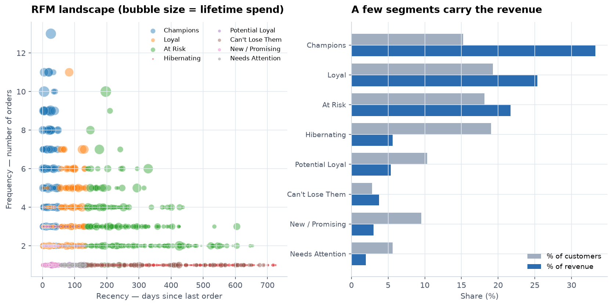

# Retail Analytics

An end-to-end data analysis project in Python: it generates a realistic retail
dataset, cleans it, analyses it with proper statistical tests, and produces a
set of charts plus a written report.

Everything runs from one command and finishes in a few seconds.

```bash
pip install -r requirements.txt
python run_pipeline.py
```

Output lands in `reports/findings.md` and `reports/figures/`.

<p align="center">
  
  
</p>

---

## Why the data is synthetic

There is no dependency on a downloadable dataset that may vanish or change, and
the simulation lets the analysis be checked against a known answer: seasonality,
promotional lifts and a long-tail product distribution are deliberately built in,
so a correct pipeline should recover them.

The generator also injects the defects you meet in real exports — mixed date
formats, decimal-point typos, duplicate rows, negative quantities standing in
for returns, inconsistent country spellings, missing values. The cleaning stage
therefore has genuine work to do rather than being a formality.

To point the project at real data instead, replace `src/generate_data.py` and
keep the column contract in `src/data_prep.py`.

---

## Structure

```
retail_analytics/
├── run_pipeline.py           # runs every stage end to end
├── requirements.txt
├── src/
│   ├── config.py             # paths, constants, thresholds, palette
│   ├── generate_data.py      # synthetic dataset + deliberate defects
│   ├── data_prep.py          # cleaning, validation, audit trail
│   ├── analysis.py           # KPIs, RFM, cohorts, hypothesis tests
│   ├── viz.py                # the seven report figures
│   ├── report.py             # markdown report built from computed numbers
│   └── io_utils.py           # parquet with automatic CSV fallback
├── tests/                    # 37 tests over cleaning and analysis
├── data/
│   ├── raw/                  # generated CSVs (the "source system" export)
│   └── processed/            # cleaned table + analysis outputs
└── reports/
    ├── findings.md
    └── figures/
```

### Pipeline stages

| Stage | Module | Output |
|---|---|---|
| 1. Generate | `generate_data.py` | `data/raw/*.csv` |
| 2. Clean | `data_prep.py` | `data/processed/orders_clean.parquet`, `quality_report.csv` |
| 3. Analyse | `analysis.py` | RFM, cohort, category tables |
| 4. Visualise | `viz.py` | `reports/figures/*.png` |
| 5. Report | `report.py` | `reports/findings.md` |

Useful flags:

```bash
python run_pipeline.py --skip-data     # reuse existing raw CSVs
python run_pipeline.py --no-figures    # numbers only
python -m pytest tests/ -q             # run the test suite
```

Each module is also runnable on its own (`python -m src.analysis`).

---

## What the analysis covers

- **Descriptive KPIs** — revenue, profit, margin, AOV, repeat rate, return rate
- **Trend** — monthly series with linear *and* log-linear fits, so the reported
  figure is a growth rate when the series compounds
- **Mix** — category revenue vs margin, product-level Pareto concentration
- **Customers** — RFM scoring into eight named segments
- **Cohorts** — monthly retention matrix with left-censoring handled
- **Promotions** — Mann–Whitney test on daily revenue, plus profit by discount band
- **Channels** — Kruskal–Wallis test on lifetime value

---

## Findings

| Finding | Evidence |
|---|---|
| Revenue compounds at ~10%/month | log-linear R² = 0.89 vs linear 0.69 |
| Electronics is 58% of revenue at 15% margin; Beauty is 3% at 56% | inverted mix |
| Retention falls to ~16% at month 1, then holds flat near 13% | cohorts of 30+ |
| Promotional days lift daily revenue 7% | Mann–Whitney, p = 0.010 |
| **Discounts beyond 20% lose money** | units/line varies only 0.08 across all bands |
| Acquisition channel does not predict lifetime value | Kruskal–Wallis, p = 0.85 |

The discount result is the one with operational teeth: if deep discounts moved
volume, units per order line would rise with the discount band. It does not
move at all, which means the discount is being handed to customers who would
have bought anyway.

The channel result is a genuine negative finding, and useful as one — it says
allocate budget on acquisition *cost*, because there is no evidence of a
quality difference between channels.

---

## Analytical decisions worth knowing about

Several things looked fine at first and were not:

**An established customer base.** The first version started from zero
customers, which left the opening months nearly empty and made every trend look
explosive. Customers are now seeded across the two years preceding the window.

**Growth rate, not slope.** A straight line fit the revenue series poorly and
projected negative revenue at the start. The code fits both models and reports
whichever has the higher R², so a compounding series yields a percentage rate.

**Left-censored cohorts.** Customers who joined before the observation window
have a first *observed* order that is not their first order. Counting them
places established buyers in new-customer cohorts and overstates early
retention, so they are excluded.

**Small-cohort noise.** In a cohort of three, one repeat purchase reads as 33%
retention. Cohorts below 30 customers are excluded from the average curve.

**Unobserved is not zero.** A cohort formed last month has no month-6 retention
yet. Those cells are NaN, not 0%, so the average curve is not dragged down by
periods that have not happened.

**Outliers are flagged, not deleted.** Large orders are marked with
`is_outlier` using an IQR fence and left in the data. A high-value order is
usually a real customer, not an error, and silently dropping it understates
revenue.

---

## Testing

37 tests covering the parts most likely to break silently:

- date parsing across all three formats, including day-first ambiguity
- country normalisation collapsing `DE` / `GERMANY` / `  germany ` to one label
- the price-typo repair firing on a stray zero but not on a legitimately high price
- revenue/profit arithmetic and returned-line handling
- RFM recency inversion (a recent buyer must outscore a lapsed one)
- cohort retention against hand-computed values, including the NaN cases

```bash
python -m pytest tests/ -q
```

---

## Limitations

- The data is synthetic; the findings demonstrate the method rather than
  describe a real business.
- Promotional periods coincide with Black Friday and Christmas, so the promo
  lift confounds discounting with seasonal demand. Separating them needs a
  holdout region or randomised discount assignment.
- Retention uses purchase recurrence only — no browsing or marketing-contact data.
- Returns are modelled as a flat per-line probability with an assumed 15%
  processing cost.
