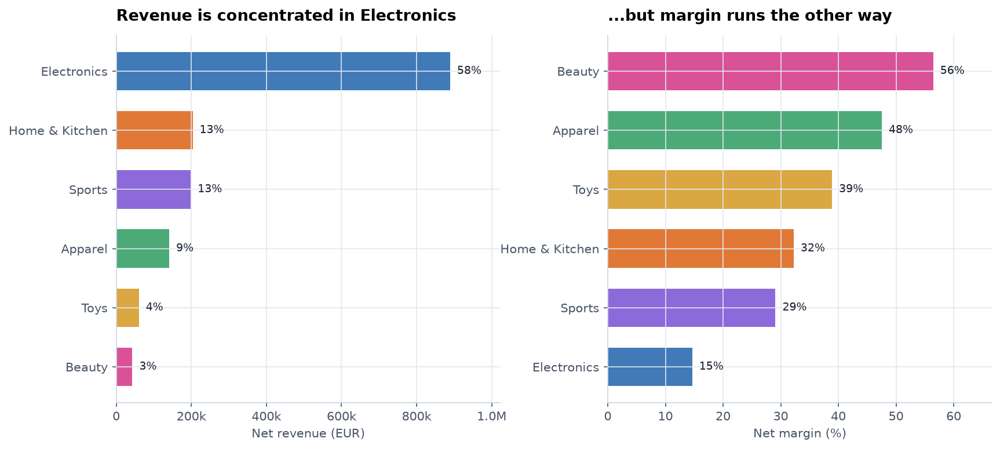
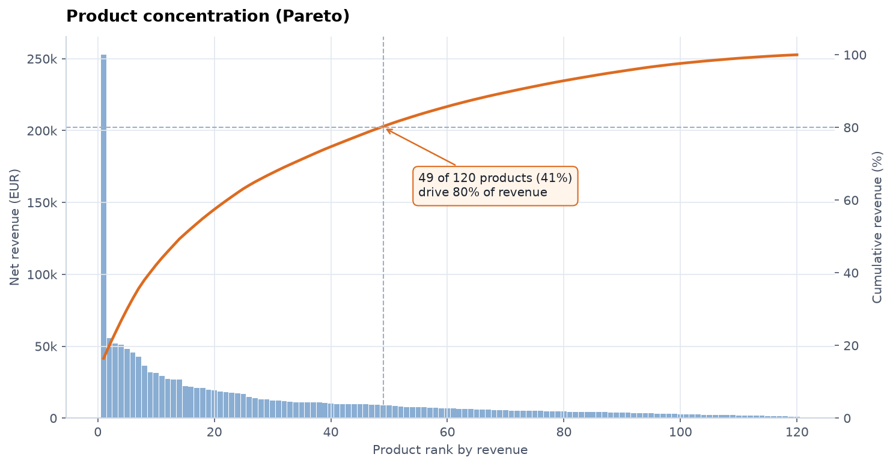
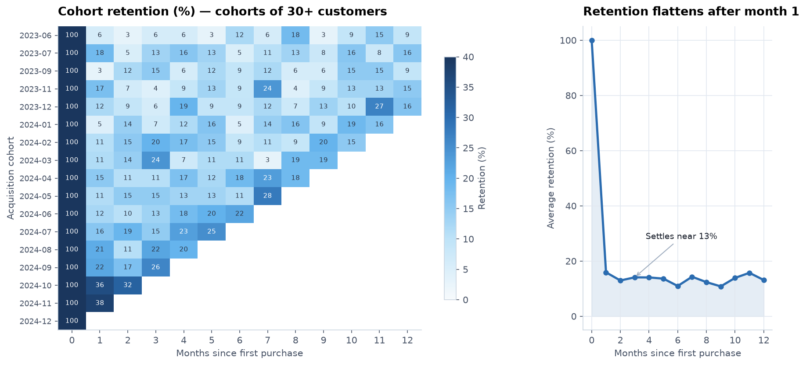
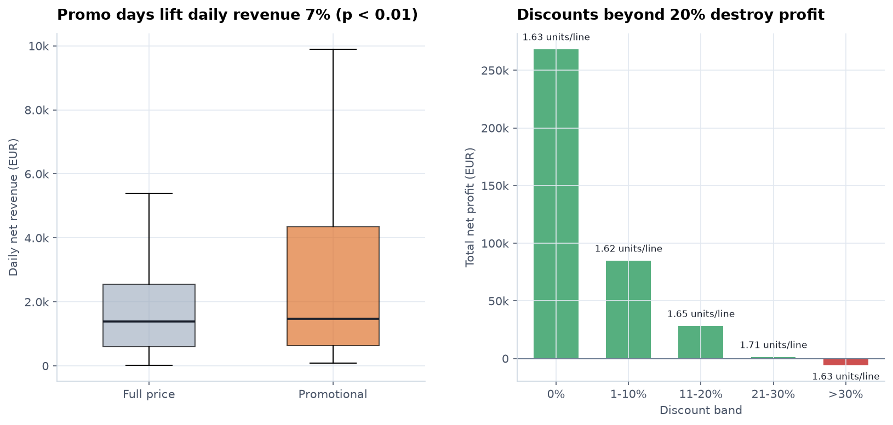
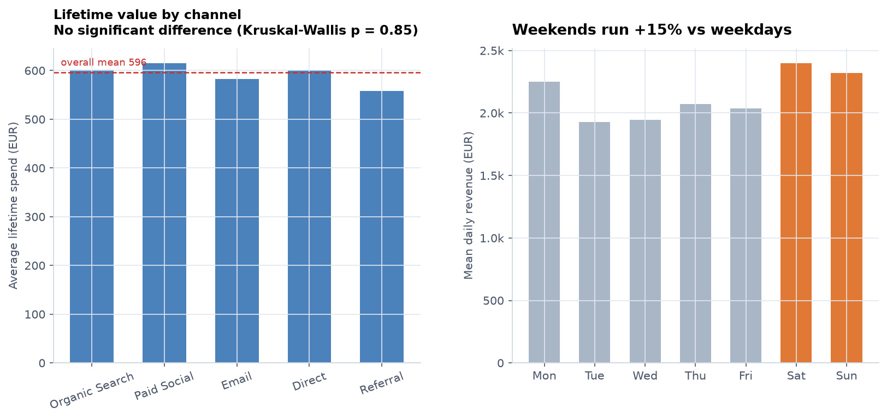

# Retail Performance Analysis

**Period analysed:** 01 January 2023 – 31 December 2024  
**Scope:** 14,119 order lines · 5,785 orders · 2,601 customers

> Generated from synthetic data by `src/report.py`. Every number below is computed at build time from the cleaned dataset.

---

## 1. Headline numbers

| Metric | Value |
|---|---|
| Net revenue | 1,535,805 EUR |
| Net profit | 368,501 EUR (24.0% margin) |
| Orders | 5,785 |
| Active customers | 2,601 |
| Average order value | 265 EUR |
| Median order value | 172 EUR |
| Units sold | 22,206 |
| Repeat purchase rate | 56.5% |
| Return rate | 3.9% |

## 2. Revenue is compounding, not growing linearly

Monthly revenue is better described by an exponential fit (R² = 0.89) than a straight line (R² = 0.69), which implies a compounding growth rate of **9.8% per month** rather than a fixed 6,065 EUR increment.

Two seasonal patterns repeat in both years: a sharp November–December peak and a January contraction, followed by a mid-summer lull. Growth targets set off a December run-rate will be missed every January — the comparison to make is year-over-year, not month-over-month.

## 3. The revenue leader is the margin laggard

Electronics generates 58% of revenue at a 15% margin, while Beauty earns 56% on just 3% of revenue. The categories are almost perfectly inverted on the two measures.

| Category | Net revenue | Rev share % | Margin % | Avg disc % | Return % |
|---|---|---|---|---|---|
| Electronics | 889,230.1 | 57.9 | 14.6 | 7.9 | 4.4 |
| Home & Kitchen | 203,566.8 | 13.3 | 32.3 | 7.8 | 4.0 |
| Sports | 198,542.6 | 12.9 | 29.1 | 7.9 | 3.7 |
| Apparel | 141,162.7 | 9.2 | 47.5 | 7.8 | 3.4 |
| Toys | 60,275.6 | 3.9 | 38.9 | 7.5 | 3.8 |
| Beauty | 43,027.6 | 2.8 | 56.4 | 7.6 | 4.3 |

Product-level revenue is similarly concentrated: **49 of 120 products (41%)** account for 80% of revenue.

## 4. Customer value is concentrated in two segments

**Champions** are 15% of customers but 33% of revenue, averaging 1,303 EUR lifetime spend across 4.5 orders.

**At Risk** is the segment to act on: 468 customers holding 22% of revenue (332,947 EUR), but averaging 267 days since their last order. They have bought 2.5 times on average, so the relationship exists — it has simply gone quiet.

| Segment | Customers | Cust % | Rev % | Avg orders | Avg spend | Avg recency (d) |
|---|---|---|---|---|---|---|
| Champions | 392.0 | 15.2 | 33.3 | 4.5 | 1,303.2 | 22.4 |
| Loyal | 497.0 | 19.3 | 25.3 | 2.8 | 783.1 | 61.0 |
| At Risk | 468.0 | 18.2 | 21.7 | 2.5 | 711.4 | 267.1 |
| Hibernating | 490.0 | 19.0 | 5.6 | 1.0 | 176.2 | 349.9 |
| Potential Loyal | 266.0 | 10.3 | 5.4 | 1.6 | 310.9 | 51.2 |
| Can't Lose Them | 73.0 | 2.8 | 3.7 | 1.0 | 787.8 | 356.2 |
| New / Promising | 246.0 | 9.5 | 3.0 | 1.1 | 188.8 | 24.4 |
| Needs Attention | 145.0 | 5.6 | 1.9 | 1.1 | 205.3 | 96.4 |

## 5. Retention collapses after the first month, then holds

Across cohorts of 30+ customers, month-1 retention is 16%, after which the curve is essentially flat at **13%** through month 12. A flat tail is the good news — the customers who come back a second time keep coming back. The loss is almost entirely in the first 30 days.

Cohorts whose members joined before the observation window are excluded: their first *observed* order is not their first order, and counting them would mix established buyers into new-customer cohorts.

## 6. Promotions lift revenue and destroy profit

Promotional days carry a median daily revenue of 1,471 EUR versus 1,379 EUR at full price — a **7% lift**, statistically significant (Mann–Whitney U, p = 0.010, 87 promo days vs 714 baseline days).

The revenue lift is real. The profit case is not:

| Discount band | Order lines | Avg units/line | Avg line revenue | Avg margin % | Total profit |
|---|---|---|---|---|---|
| 0% | 7,214.0 | 1.6 | 121.9 | 40.5 | 268,244.6 |
| 1-10% | 3,078.0 | 1.6 | 113.1 | 35.2 | 84,798.4 |
| 11-20% | 1,867.0 | 1.6 | 101.2 | 27.0 | 28,198.0 |
| 21-30% | 973.0 | 1.7 | 86.6 | 14.9 | 1,241.3 |
| >30% | 431.0 | 1.6 | 80.8 | -1.2 | -6,083.9 |

Average units per line varies by only 0.08 across every discount band, from full price to over 30% off. Discounting is not making people buy more; it is selling the same basket for less. Bands above 20% contributed **-6,084 EUR** in net profit — that is, they lost money.

## 7. Acquisition channel does not predict customer value

Mean lifetime spend ranges from 558 EUR to 615 EUR across the five channels, but a Kruskal–Wallis test finds no significant difference (p = 0.85). The spread is consistent with noise.

This is a useful negative result: it means budget should be allocated on acquisition **cost**, not on an assumed quality difference between channels. If one channel acquires customers more cheaply, take it — the customers it brings are worth about the same.

## 8. What to do about it

1. **Cap discounts at 20%.** Bands beyond that lost 6,084 EUR with no measurable increase in units per order. Reserve deep cuts for genuine stock clearance, not for calendar promotions.
2. **Run a first-30-day onboarding programme.** Retention falls from 100% to 16% in a single month and is stable thereafter, so the entire retention problem sits in that window.
3. **Win back At Risk customers.** 468 customers, 332,947 EUR of historical value, dormant for 267 days on average.
4. **Protect the mix.** Electronics drives volume at 15% margin; growing Beauty and other high-margin categories improves profit faster than growing revenue does.
5. **Buy on cost, not channel reputation.** With no significant LTV difference between channels, the cheapest acquisition wins.

---

## 9. Limitations

- The dataset is **synthetic**, generated by `src/generate_data.py`. The relationships it contains were put there by the simulation, so the findings demonstrate the method rather than describe a real business.
- Promotional periods coincide with Black Friday and Christmas, so the promo lift confounds discounting with seasonal demand. Separating the two would need a holdout region or a randomised discount test.
- Retention is measured on purchase recurrence only; no browsing, support or marketing-contact data is available.
- Returns are modelled as a flat probability per line and carry an assumed 15% processing cost.
